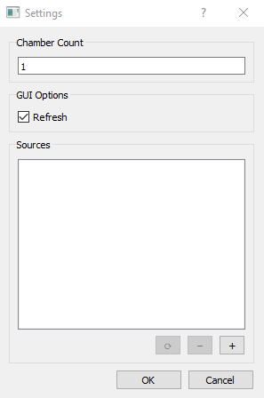
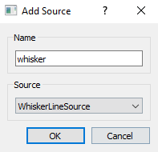

# Running a task on hardware

In the following, we will show how to set up the workstation to run a task on
operant hardware. This is not a complete overview of all possible configuration
but will guide you through adding Sources to the Workstation and creating new
AddressFiles and Protocols for local configuration.

## Example task

For this tutorial we will be setting up the Workstation to run a simple bar 
press task where a rodent needs to press a bar to receive a pellet reward. In
the TNEL, we run this task using hardware developed by Lafayette Instruments 
and communicate with the chamber using the Whisker Server. Additionally, we 
simultaneously record video during the task via a webcam.

## Adding Sources to the Workstation

Without Sources, tasks can only interact with the GUI itself. To connect to our
hardware, we need to link the hardware to the Workstation by adding Sources.
This only needs to be done once whenever new hardware is needed by the system.
Sources can be added by going to File->Settings to open the SettingsDialog.

Available Sources are indicated by the list. Initially, you should only see
the empty source "es" that is used to simulate interaction with the GUI. For
this tutorial we will be adding a WhiskerLineSource to communicate with the 
digital inputs and outputs in the operant chamber and a VideoSource to control
the webcam. To add a Source, press the "+" button to bring up the AddSourceDialog.

Available Sources can be selected from the dropdown and named via the upper
textbox. For Whisker, we will be adding a WhiskerLineSource named "whisker".
The name is arbitrary but be referred to later when making the AddressFile.
Some Sources, like the WhiskerLineSource, might require more parameters to 
set up. If so, a second Dialog, the SourceParametersDialog, will pop up 